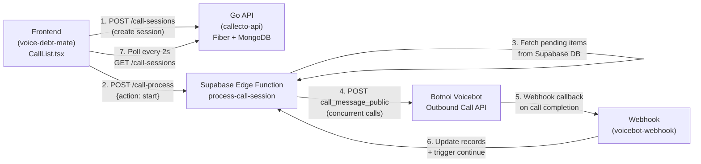
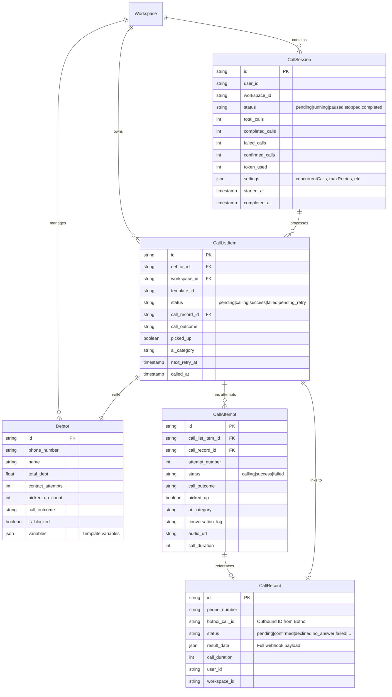
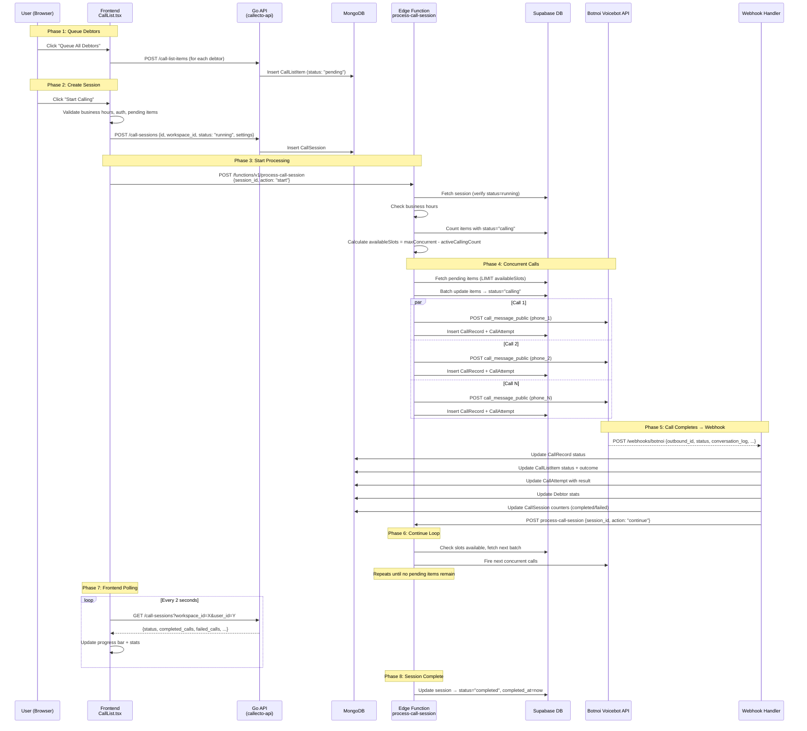
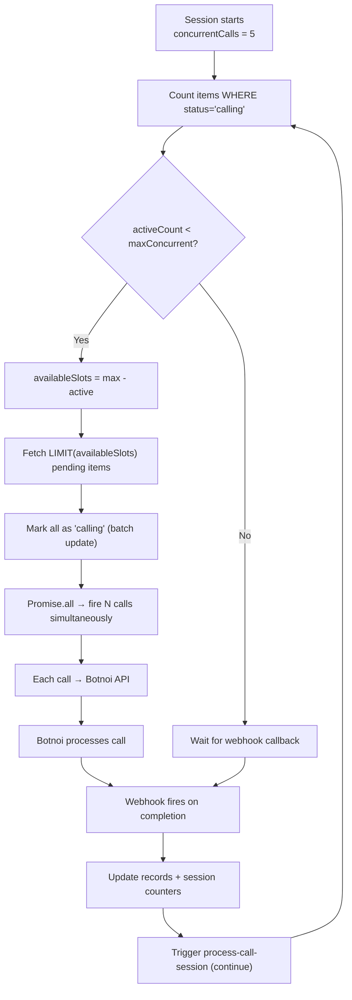
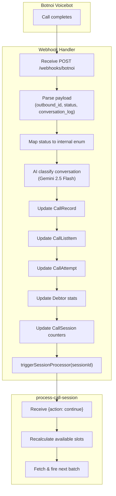
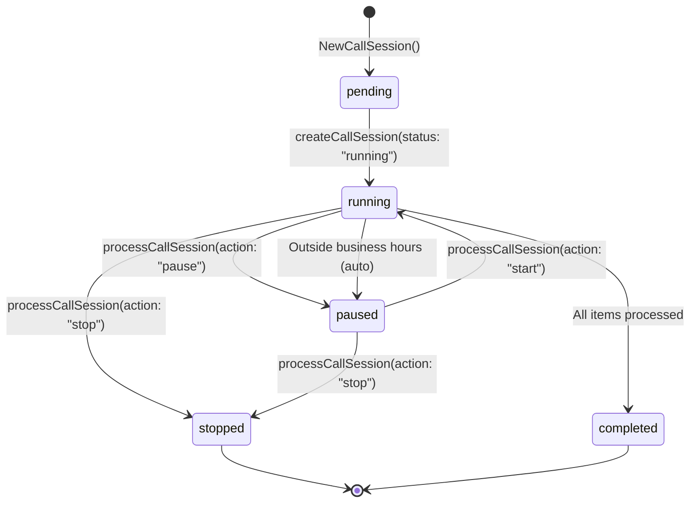
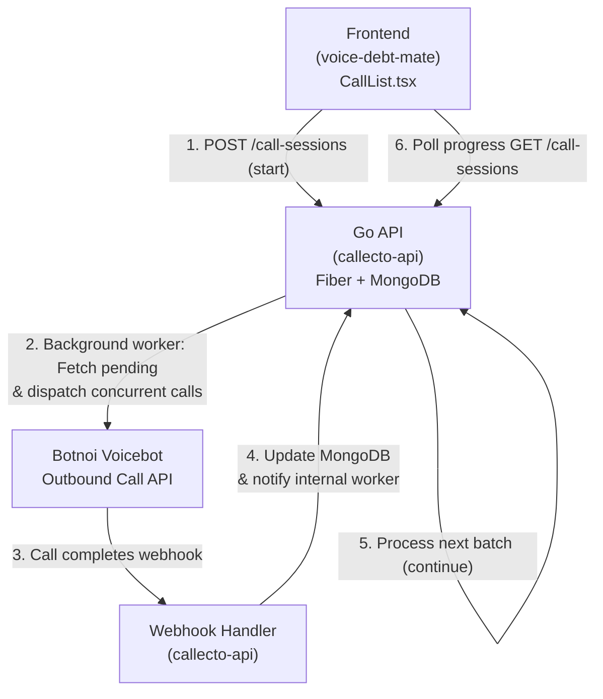
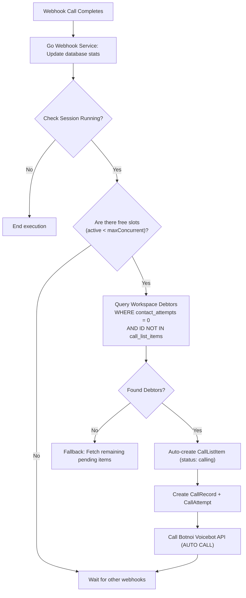

# FLOW.md — Process Call Session: Concurrent Calling Architecture

> **Scope**: This document covers how the frontend (`voice-debt-mate`) initiates and manages concurrent outbound calls through the backend (`callecto-api`) and Supabase Edge Functions, focusing exclusively on the **`process-call-session`** workflow.

---

## Table of Contents

1. [High-Level Architecture](#1-high-level-architecture)
2. [Entity Relationship Model](#2-entity-relationship-model)
3. [End-to-End Flow Diagram](#3-end-to-end-flow-diagram)
4. [Step-by-Step Workflow](#4-step-by-step-workflow)
5. [Concurrency Model](#5-concurrency-model)
6. [API Contracts](#6-api-contracts)
7. [Frontend Session Management](#7-frontend-session-management)
8. [Backend Processing Logic](#8-backend-processing-logic)
9. [Webhook Callback Loop](#9-webhook-callback-loop)
10. [Session Lifecycle States](#10-session-lifecycle-states)
11. [Settings & Configuration](#11-settings--configuration)
12. [File Reference Map](#12-file-reference-map)
13. [Future Go API-Only Migration Plan](#13-future-go-api-only-migration-plan)
14. [Future Auto-Calling Workflow for Uncalled Debtors](#14-future-auto-calling-workflow-for-uncalled-debtors)

---

## 1. High-Level Architecture



The system uses a **fire-and-forget** pattern where the frontend sends a single "start" command, and the backend processes calls autonomously in the background — even if the user closes the browser.

---

## 2. Entity Relationship Model



### Row Cardinality & Data Creation Rules

Within a specific workspace, data is stored and created according to these cardinalities:

*   **`CallSession`** (Campaign run): **1 Row per Campaign Run**
    *   Created when the user starts a session from the frontend.
    *   Tracks overall settings (concurrency, retries, schedules) and aggregate metrics (total, completed, failed, confirmed calls) for that specific run.
*   **`CallListItem`** (Debtor target queue): **1 Row per Target Debtor**
    *   Represents the debtor queued to be called.
    *   **Reused on retry**: If a debtor call fails or has no answer and needs to be called again, the **same** `CallListItem` row is updated (status resets to `pending_retry` or `pending` with `next_retry_at` scheduled).
    *   Always maintains the latest call state, latest call outcome, and the reference to the latest `CallRecord` (`call_record_id`).
*   **`CallRecord`** (Attempt details): **1 Row per Physical Outbound Call Attempt (1 Call = 1 Row)**
    *   A new row is created every single time an API request is successfully dispatched to Botnoi Voicebot (generating a unique `botnoi_call_id`).
    *   If a debtor is called 3 times (the initial call + 2 retries), there will be **1** `CallListItem` row, but **3** separate `CallRecord` rows (and 3 corresponding `CallAttempt` rows documenting conversation details, durations, and audio URLs).

---

## 3. End-to-End Flow Diagram



---

## 4. Step-by-Step Workflow

### Phase 1: Queue Debtors into Call List

The user queues debtors (from the Debtors list) as pending call items:

| Step | Actor | Action | API Call |
|------|-------|--------|---------|
| 1 | User | Clicks "Queue All Debtors" | — |
| 2 | Frontend | Filters debtors not yet in queue | — |
| 3 | Frontend | Creates CallListItem per debtor | `POST /api/v1/call-list-items` × N (concurrently via `Promise.all`) |

Each `CallListItem` is created with `status: "pending"` and linked to a `debtor_id`.

### Phase 2: Create Call Session

| Step | Actor | Action | Details |
|------|-------|--------|---------|
| 1 | User | Clicks "Start Calling" | — |
| 2 | Frontend | Validates preconditions | Business hours, auth, pending items > 0 |
| 3 | Frontend | Generates UUID for session | `crypto.randomUUID()` |
| 4 | Frontend | Creates session record | `POST /api/v1/call-sessions` with settings |
| 5 | Frontend | Triggers processing | `POST /functions/v1/process-call-session {action: "start"}` |

```typescript
// CallList.tsx — startCallingSession function
const sessionId = crypto.randomUUID();
await createCallSession({
  id: sessionId,
  workspace_id: currentWorkspace.id,
  status: "running",
  total_calls: pendingItems.length,
  settings: settings as unknown as CallSessionSettings,
});
await processCallSession({ session_id: sessionId, action: "start" });
```

### Phase 3: Backend Processing (Supabase Edge Function)

The `process-call-session` Edge Function runs the core loop:

| Step | Action | Details |
|------|--------|---------|
| 1 | Fetch session | `SELECT * FROM call_sessions WHERE id = sessionId` |
| 2 | Validate status | Stop if not `"running"` |
| 3 | Check business hours | Pause session if outside configured hours |
| 4 | Count active calls | `SELECT count FROM call_list_items WHERE status = 'calling'` |
| 5 | Reset stale items | Any item in `"calling"` for > 5 minutes → set to `"failed"` |
| 6 | Calculate slots | `availableSlots = maxConcurrent - activeCallingCount` |
| 7 | Fetch pending items | `SELECT * FROM call_list_items WHERE status IN ('pending','retry_pending') LIMIT slots` |
| 8 | Batch mark as calling | `UPDATE call_list_items SET status='calling' WHERE id IN (...)` |
| 9 | Process concurrently | `await Promise.all(pendingItems.map(processItem))` |
| 10 | Update session stats | Increment `completed_calls`, `failed_calls`, `token_used` |
| 11 | Check for more items | If slots available and items remain → **recursive call** to self |
| 12 | If no items remain | Set session `status: "completed"` |

### Phase 4: Per-Item Call Processing (`processItem`)

For each item in the concurrent batch:

| Step | Action |
|------|--------|
| 1 | Resolve debtor from `debtorMap` |
| 2 | Skip if debtor is blocked |
| 3 | Resolve template (or use default) |
| 4 | Prepare voicebot variables (Thai date, policy number phonetics) |
| 5 | POST to Botnoi Voicebot API with call payload |
| 6 | On success: create `CallRecord` (status: `"pending"`) |
| 7 | Update `CallListItem` with `call_record_id` |
| 8 | Create `CallAttempt` (status: `"calling"`) |
| 9 | Increment debtor `contact_attempts` |
| 10 | On failure: update item to `status: "failed"` |

### Phase 5: Webhook Callback

When Botnoi completes a call, it sends a webhook:

| Step | Actor | Action |
|------|-------|--------|
| 1 | Botnoi | POST to webhook endpoint with call result |
| 2 | Webhook | Map status to internal taxonomy (confirmed/declined/no_answer/etc.) |
| 3 | Webhook | AI categorize conversation log (via Gemini) |
| 4 | Webhook | Update `CallRecord` with final status + result_data |
| 5 | Webhook | Update matching `CallListItem` status + outcome |
| 6 | Webhook | Update matching `CallAttempt` with conversation_log, audio_url |
| 7 | Webhook | Update `Debtor` stats (contact_attempts, picked_up_count, etc.) |
| 8 | Webhook | Update `CallSession` counters (completed_calls, failed_calls, confirmed_calls) |
| 9 | Webhook | **Trigger `process-call-session` with `action: "continue"`** |

> **This is the key re-entry point**: The webhook triggers the Edge Function again to fill freed-up concurrency slots with the next batch of pending items.

---

## 5. Concurrency Model



### Concurrency Rules

| Rule | Value | Source |
|------|-------|-------|
| Max concurrent calls | 1–10 (default: 5) | `settings.concurrentCalls` |
| Slot calculation | `maxConcurrent - activeCallingCount` | Queried from `call_list_items WHERE status='calling'` |
| Stale timeout | 5 minutes | Items in `"calling"` with `called_at` older than 5 min are reset to `"failed"` |
| Retry delay | 1 minute | Items with `status: "pending_retry"` wait for `next_retry_at` |
| Parallelism mechanism | `Promise.all()` | All items in a batch are fired simultaneously |

### How the "Conveyor Belt" Works

1. **Session starts**: Edge Function picks up `N` items (where `N = concurrentCalls`), marks them as `"calling"`, fires all calls simultaneously.
2. **Call completes**: Botnoi webhook updates the item status to a terminal state (`success`/`failed`).
3. **Webhook triggers continue**: The webhook handler calls `POST /functions/v1/process-call-session {action: "continue"}`.
4. **Next batch fires**: The Edge Function recalculates available slots and fills them with the next pending items.
5. **Repeat** until no pending items remain, then mark session `"completed"`.

This creates a **self-sustaining loop** where the system maintains `maxConcurrent` active calls at all times until all items are processed.

---

## 6. API Contracts

### Frontend → Go API (callecto-api)

#### `POST /api/v1/call-sessions` — Create Session

```json
// Request
{
  "id": "uuid-v4",
  "workspace_id": "workspace-uuid",
  "status": "running",
  "total_calls": 42,
  "settings": {
    "maxRetries": 2,
    "delayBetweenCalls": 5,
    "concurrentCalls": 5,
    "businessHoursOnly": true,
    "businessHoursStart": "09:00",
    "businessHoursEnd": "18:00",
    "businessDays": [1, 2, 3, 4, 5],
    "testMode": false,
    "timezoneOffset": 420,
    "interruptible": false
  }
}

// Response 200
{ "message": "success" }
```

#### `GET /api/v1/call-sessions?workspace_id=X&user_id=Y` — Poll Sessions

```json
// Response 200
{
  "message": "success",
  "data": [
    {
      "id": "session-uuid",
      "status": "running",
      "total_calls": 42,
      "completed_calls": 15,
      "failed_calls": 3,
      "confirmed_calls": 8,
      "token_used": 18,
      "started_at": "2026-06-22T10:00:00Z",
      "completed_at": null
    }
  ]
}
```

#### `PUT /api/v1/call-sessions/:id` — Update Session

Used by the frontend to set `status: "running"` when resuming a paused session.

### Frontend → Supabase Edge Function (process-call-session)

#### `POST /functions/v1/process-call-session`

```json
// Start processing
{ "session_id": "uuid", "action": "start" }

// Pause (from frontend)
{ "session_id": "uuid", "action": "pause" }

// Stop completely (from frontend)
{ "session_id": "uuid", "action": "stop" }

// Continue (from webhook, triggers next batch)
{ "session_id": "uuid", "action": "continue" }
```

| Action | Behavior |
|--------|----------|
| `start` | Begin or resume processing with `EdgeRuntime.waitUntil()` for background execution |
| `continue` | Same as `start` — triggered by webhook after a call completes |
| `pause` | Set session `status: "paused"`, processing stops at next check |
| `stop` | Set session `status: "stopped"` + `completed_at`, terminate immediately |

### Go Backend → Supabase Edge Function (via webhook)

The Go webhook service triggers re-processing after updating session counters:

```go
// webhook.go — triggerSessionProcessor
func (s *webhookService) triggerSessionProcessor(sessionID string) {
    url := fmt.Sprintf("%s/functions/v1/process-call-session", supabaseURL)
    payload := map[string]string{"session_id": sessionID, "action": "continue"}
    // POST with SUPABASE_SERVICE_ROLE_KEY
}
```

### Edge Function → Botnoi Voicebot API

```json
// POST https://bn-voicebot-system-9ehp.onrender.com/api/voicebot/custom/call_message_public
{
  "outbound_id": "outbound_<call_list_item_id>",
  "event_id": "event_<session_id>_<item_id>",
  "tel_number": "0812345678",
  "phonenumber": "0812345678",
  "variables": {
    "name": "สมชาย",
    "outstanding_amount": "หนึ่งหมื่นห้าพัน",
    "due_date": "วันจันทร์ ที่ 22 มิถุนายน 2569",
    "policy_no": "หนึ่ง สอง สาม สี่ ห้า"
  },
  "bot_id": "6a06964fb875327d960f05f0",
  "bot_type": "Confirm1",
  "speaker": "212",
  "language": "th",
  "tts": "voicebot-premium",
  "asr_provider": "botnoi-aws-th-noise-classifier-v17c",
  "interruptible": "True"
}
```

---

## 7. Frontend Session Management

### Session Polling

The frontend polls for active session status every **2 seconds**:

```typescript
// CallList.tsx — lines 453-469
const { data: activeSession, refetch: refetchSession } = useQuery({
  queryKey: ["active-call-session", effectiveUserId, currentWorkspace?.id],
  queryFn: async () => {
    const sessions = await listCallSessions({
      workspace_id: currentWorkspace.id,
      user_id: effectiveUserId,
    });
    const active = sessions
      .filter((s) => ["running", "stopping", "paused"].includes(s.status))
      .sort((a, b) => (b.created_at || "").localeCompare(a.created_at || ""));
    return active[0] ?? null;
  },
  refetchInterval: 2000,
});
```

Call list items are polled every **10 seconds** for individual status updates.

> **No WebSocket/realtime** — the system relies entirely on polling.

### User Actions

| Action | Frontend Function | API Call |
|--------|-------------------|----------|
| Start Calling | `startCallingSession()` | `createCallSession()` + `processCallSession({action: "start"})` |
| Pause | `pauseCallingSession()` | `processCallSession({action: "pause"})` |
| Resume | `resumeCallingSession()` | `updateCallSession({status: "running"})` + `processCallSession({action: "start"})` |
| Stop | `stopCallingSession()` | `processCallSession({action: "stop"})` |

### Progress Display

The UI shows a live progress banner with:

- **Progress bar**: `(completed_calls + failed_calls) / total_calls`
- **Active calls**: `callingCount / concurrentCalls max`
- **Completed count**: `session.completed_calls`
- **Confirmed count**: `session.confirmed_calls`
- **Failed count**: `session.failed_calls`
- **Tokens used**: `session.token_used`

---

## 8. Backend Processing Logic

### Two Backend Systems

| System | Where | Handles |
|--------|-------|---------|
| **Go API** (`callecto-api`) | `src/services/call_sessions.go` | CRUD for sessions, records, items, attempts. Webhook processing. Session counter updates. |
| **Supabase Edge Function** | `supabase/functions/process-call-session/` | Orchestration logic: pick pending items, manage concurrency slots, fire calls to Botnoi, loop control. |

### Go API Call Session Service

The Go service provides CRUD with ownership checks:

```go
// services/call_sessions.go
type ICallSessionsService interface {
    CreateCallSessionByUser(callerUserID string, data CallSessionDataModel) error
    GetCallSessionsByUser(callerUserID string, filter CallSessionFilter) (*[]CallSessionDataModel, error)
    UpdateCallSessionByUser(callerUserID string, id string, data CallSessionDataModel) error
    DeleteCallSessionByUser(callerUserID string, id string) error
}
```

All "ByUser" methods enforce ownership — `callerUserID` must match the session's `UserID`.

### Go Webhook Processing (`webhook.go`)

After receiving a webhook from Botnoi:

1. **Resolve call identity**: Find `CallRecord` by `botnoi_call_id`, fallback to `Debtor` by phone number
2. **Map status**: Botnoi raw status → internal status enum (confirmed/declined/no_answer/etc.)
3. **AI categorize**: Send conversation log to Gemini for classification into 16 categories
4. **Cascade updates**: CallRecord → CallListItem → CallAttempt → Debtor → CallSession
5. **Re-trigger**: Call `triggerSessionProcessor(sessionID)` to fire the next batch

---

## 9. Webhook Callback Loop



### Status Mapping (Webhook)

| Botnoi Status / Action | Mapped Status | Final Status |
|------------------------|---------------|-------------|
| action=confirm/yes | `confirmed` | `success` |
| action=decline/no | `declined` | `success` |
| action=unknown | `no_response` | `success` |
| status=completed (user spoke) | `completed` | `success` |
| status=completed (no user speech) | `no_answer` | `failed` |
| status=hanged_up/hangup | `hanged_up` | `failed` |
| status=no answer | `no_answer` | `failed` |
| status=busy | `busy` | `failed` |
| status=failed/error | `failed` | `failed` |
| status=rejected | `rejected` | `failed` |
| status=voicemail | `voicemail` | `failed` |

---

## 10. Session Lifecycle States



| Status | Meaning | Triggered By |
|--------|---------|-------------|
| `pending` | Session created, not yet started | Default on creation |
| `running` | Actively processing calls | User clicks "Start" or "Resume" |
| `paused` | Temporarily halted | User clicks "Pause" or auto (outside business hours) |
| `stopped` | Terminated by user | User clicks "Stop" |
| `completed` | All items processed | Automatic when no pending items and no active calls remain |

---

## 11. Settings & Configuration

### AutoDialSettings (passed in session creation)

| Setting | Type | Default | Description |
|---------|------|---------|-------------|
| `concurrentCalls` | `number` | `5` | Max simultaneous outbound calls (1–10) |
| `maxRetries` | `number` | `2` | Max retry attempts per debtor |
| `delayBetweenCalls` | `number` | `5` | Seconds between batches |
| `businessHoursOnly` | `boolean` | `true` | Restrict to business hours |
| `businessHoursStart` | `string` | `"09:00"` | Start of calling window |
| `businessHoursEnd` | `string` | `"18:00"` | End of calling window |
| `businessDays` | `number[]` | `[1,2,3,4,5]` | Mon-Fri (0=Sun, 6=Sat) |
| `testMode` | `boolean` | `false` | Simulate calls without hitting Botnoi API |
| `timezoneOffset` | `number` | Auto-detect | UTC offset in minutes (e.g., +7h = 420) |
| `interruptible` | `boolean` | `false` | Whether bot speech can be interrupted |

### Environment Variables

| Variable | Used By | Purpose |
|----------|---------|---------|
| `VITE_CALLECTO_API_URL` | Frontend | Go API base URL (e.g., `http://localhost:1818/api/v1`) |
| `SUPABASE_URL` | Go API, Edge Functions | Supabase project URL |
| `SUPABASE_SERVICE_ROLE_KEY` | Go API, Edge Functions | Service role key for server-to-server calls |
| `LOVABLE_API_KEY` | Go webhook | API key for AI classification |

---

## 12. File Reference Map

### callecto-api (Go Backend)

| File | Purpose |
|------|---------|
| [call_sessions.go](file:///home/cellul4r/Documents/botnoi/callecto-api/domain/entities/call_sessions.go) | `CallSessionDataModel` entity + filter |
| [call_records.go](file:///home/cellul4r/Documents/botnoi/callecto-api/domain/entities/call_records.go) | `CallRecordDataModel` entity + status enum |
| [call_attempts.go](file:///home/cellul4r/Documents/botnoi/callecto-api/domain/entities/call_attempts.go) | `CallAttemptModel` entity |
| [call_list_items.go](file:///home/cellul4r/Documents/botnoi/callecto-api/domain/entities/call_list_items.go) | `CallListItemModel` entity |
| [call_sessions.go](file:///home/cellul4r/Documents/botnoi/callecto-api/src/services/call_sessions.go) | Session service (CRUD + ownership) |
| [webhook.go](file:///home/cellul4r/Documents/botnoi/callecto-api/src/services/webhook.go) | Webhook processing, AI classify, trigger loop |
| [call_sessions.go](file:///home/cellul4r/Documents/botnoi/callecto-api/src/gateways/call_sessions.go) | HTTP handlers for `/call-sessions` |
| [webhook.go](file:///home/cellul4r/Documents/botnoi/callecto-api/src/gateways/webhook.go) | HTTP handler for `/webhooks/botnoi` |
| [route.go](file:///home/cellul4r/Documents/botnoi/callecto-api/src/gateways/route.go) | All route definitions |
| [http.go](file:///home/cellul4r/Documents/botnoi/callecto-api/src/gateways/http.go) | Gateway struct + service wiring |

### voice-debt-mate (Frontend + Supabase)

| File | Purpose |
|------|---------|
| [CallList.tsx](file:///home/cellul4r/Documents/botnoi/voice-debt-mate/src/test/CallList.tsx) | Main component: session mgmt, queue, polling, UI |
| [voicebot.ts](file:///home/cellul4r/Documents/botnoi/voice-debt-mate/src/test/api/voicebot.ts) | `processCallSession()` + `makeCall()` API wrappers |
| [callSessions.ts](file:///home/cellul4r/Documents/botnoi/voice-debt-mate/src/test/api/callSessions.ts) | Session CRUD API client |
| [callRecords.ts](file:///home/cellul4r/Documents/botnoi/voice-debt-mate/src/test/api/callRecords.ts) | Record CRUD API client |
| [callListItems.ts](file:///home/cellul4r/Documents/botnoi/voice-debt-mate/src/test/api/callListItems.ts) | Call list item CRUD API client |
| [callAttempts.ts](file:///home/cellul4r/Documents/botnoi/voice-debt-mate/src/test/api/callAttempts.ts) | Attempt CRUD API client |
| [client.ts](file:///home/cellul4r/Documents/botnoi/voice-debt-mate/src/test/api/client.ts) | HTTP client with Supabase JWT auth |
| [types.ts](file:///home/cellul4r/Documents/botnoi/voice-debt-mate/src/test/api/types.ts) | TypeScript interfaces for all entities |
| [process-call-session/index.ts](file:///home/cellul4r/Documents/botnoi/voice-debt-mate/supabase/functions/process-call-session/index.ts) | Edge Function: orchestration loop, concurrent calls |
| [voicebot-webhook/index.ts](file:///home/cellul4r/Documents/botnoi/voice-debt-mate/supabase/functions/voicebot-webhook/index.ts) | Webhook handler: status mapping, AI classify, re-trigger |

---

> **Note**: The `voicebot-make-call` function is intentionally excluded from this document. It operates as a standalone single-call endpoint and is not part of the session-based concurrent calling workflow.

---

## 13. Future Go API-Only Migration Plan

In the future, the dual-system architecture (Go backend + Supabase DB & Edge Functions) will be consolidated into a unified backend using only **Go API** and **MongoDB**, eliminating Supabase Edge Functions and Supabase DB entirely.



### Migration Roadmap & Architectural Changes

1.  **Unified Database Strategy (MongoDB)**
    *   Migrate all relational tables (`call_sessions`, `call_list_items`, `call_records`, `call_attempts`, `debtors`, `call_tokens`, `call_templates`) from Supabase PostgreSQL to MongoDB collections in `callecto-api`.
    *   The Go API will become the single source of truth for all transactional calling data.
2.  **Porting Concurrency and Loop Logic**
    *   Rewrite the Deno TypeScript logic (`process-call-session`) into a Go background daemon/worker service in `callecto-api`.
    *   Utilize Go-native concurrency mechanisms (goroutines, channels, or an asynchronous task queue like Asynq/Machinery) to manage the available slots:
        $$\text{availableSlots} = \text{maxConcurrent} - \text{activeCallingCount}$$
    *   The background worker will fetch pending `CallListItem` documents from MongoDB, mark them as `calling`, and call the Botnoi API concurrently using HTTP client connection pooling.
3.  **Direct Service-to-Service Loop Re-trigger**
    *   In the future architecture, instead of using the network webhook re-trigger (`s.triggerSessionProcessor` calling Supabase via HTTP), the webhook handler service layer directly invokes the session service layer's batch processing method.
    *   This keeps the loop in-process inside the Fiber backend, eliminating external HTTP overhead, API gateways, and authorization token handshakes.
4.  **State Management & Auth**
    *   Move authentication validation in `callecto-api` middleware from checking Supabase JWT tokens to standard stateless JWTs generated directly by `callecto-api` or a custom auth provider.

### Service Layer Integration & Code Reuse

To achieve clean separation of concerns, satisfy the **Single Responsibility Principle (SRP)**, and prevent **circular dependencies** (e.g. session service needing webhook updates, and webhook service needing session processing), we will introduce a dedicated orchestration layer: **`CallSchedulerService`**.

```
       [Webhook Handler]            [Session Handler]
               │                            │
               ▼                            ▼
      [WebhookService]            [CallSessionsService]
               │                            │
               └─────────────┬──────────────┘
                             │
                             ▼
                  [CallSchedulerService]
                             │
            ┌────────────────┼────────────────┐
            ▼                ▼                ▼
    [MongoDB Repos]   [BotnoiClient]   [Workspace Mutex]
```

1.  **Dependency Injection Flow**:
    *   Both the **`WebhookService`** and the **`CallSessionsService`** depend on **`ICallSchedulerService`**.
    *   `ICallSchedulerService` has no dependency on either of them; it only communicates with database repositories (`ICallListItemsRepository`, `IDebtorsRepository`, etc.) and the `BotnoiClient`.
2.  **Unification of Calling Logic**:
    *   Both the **initial campaign start trigger** (invoked from the `CallSessionsService` start endpoint) and the **webhook completion trigger** (invoked from the `WebhookService` after updating call logs) reuse the exact same `FillAvailableSlots(...)` method inside `CallSchedulerService`.
    *   This guarantees that slot-capacity checking, uncalled-debtor selection, state transition, and API dispatch are encapsulated in a single, reusable worker class.
3.  **Migration of `process-call-session` Endpoint**:
    *   Currently, the frontend starts calling by triggering `POST /functions/v1/process-call-session` with `{ action: "start" }`.
    *   In the Go-only architecture, the Go API will expose a new HTTP route `POST /api/v1/call-sessions/:id/process` (or similar).
    *   The route handler will authenticate the caller, load the session metadata, and call `CallSchedulerService.FillAvailableSlots(ctx, workspaceID, sessionID)` to initiate the concurrency loop.
    *   This eliminates the dependency on the Supabase Edge Function Deno runtime, standardizing the execution loop on `CallSchedulerService`.

---

## 14. Future Auto-Calling Workflow for Uncalled Debtors

To improve agent utilization and efficiency, an "AUTO" calling mode will be implemented. After receiving and processing a webhook callback, the Go backend will automatically find and call debtors in the same workspace who have never been called.



### Specifications for Auto-Calling

*   **Target Selection Rule**:
    When a call slot becomes available, the Go backend will filter the workspace debtors collection using:
    1.  `contact_attempts == 0` (or `last_contact_at` is null), ensuring they have never received an outbound call.
    2.  `id NOT IN` the existing `call_list_items` collection for this workspace (to prevent double-queuing or duplicates).
*   **Automatic Ingestion**:
    *   The backend will dynamically create a new `CallListItem` for each selected debtor, bypass the manual frontend queuing interface, and mark the status directly as `calling`.
    *   It will create the corresponding `CallRecord` and `CallAttempt`.
*   **Execution Flow**:
    *   After parsing the completed call webhook and updating the counters, the backend immediately checks if the workspace session is still in `running` status.
    *   It calculates the remaining capacity. If capacity is available, it pulls uncalled debtors up to the available capacity, saves them, and dispatches the call immediately to Botnoi.
    *   This ensures the queue never runs dry as long as there are uncontacted debtors in the workspace.

---

## 15. Concurrency Race Conditions & Prevention

In a high-throughput, concurrent calling system, race conditions are a critical risk during automated debtor selection.

### The Race Condition Scenario
If two active calls finish at the exact same moment:
1.  **Webhook A** and **Webhook B** hit the Go API `/webhooks/botnoi` concurrently.
2.  Both handlers update their records and simultaneously calculate:
    $$\text{activeCalls} = 3, \quad \text{maxConcurrent} = 5 \implies \text{slotsAvailable} = 2$$
3.  Both handlers independently query the database to pull uncalled debtors.
4.  If they both fetch the same debtor (e.g., *Debtor X*), they will both attempt to trigger a call for *Debtor X*.
5.  **Result**: The debtor receives two phone calls at the same time (double dialing).

### Prevention Strategies in Go + MongoDB

To eliminate this race condition in the Go API-only architecture, the following strategies will be implemented:

1.  **Workspace-Level Serialization Lock (Recommended)**
    *   Implement an in-memory Mutex or lock registry mapping active workspaces.
    *   When the webhook handler finishes updating status and decides to check/fill slots, it must acquire the lock for that workspace.
    *   This ensures that even if 10 webhooks finish simultaneously, only one goroutine at a time can query the database for uncalled debtors and mark them as `calling`.
2.  **Atomic Database Reservation**
    *   Create a compound unique index on `call_list_items` for `(workspace_id, debtor_id)`.
    *   Use MongoDB's atomic query `FindAndModify` (or `FindOneAndUpdate`) to select the next uncalled debtor and write a `CallListItem` in a single transaction.
    *   If a parallel thread attempts to queue the same debtor, the unique constraint will trigger a duplicate key error, allowing the thread to safely catch the error and pick the next debtor.

---

## 16. Webhook Auto-Calling Example (Go Code)

Here is a conceptual implementation demonstrating the Clean Architecture structure: the **Webhook Service** handles webhook record updates and triggers the **Call Scheduler Service**, which owns the concurrent dialing logic.

```go
package services

import (
	"context"
	"fmt"
	"sync"
	"time"

	"github.com/google/uuid"
)

// =========================================================================
// 1. WEBHOOK SERVICE LAYER (webhook.go)
// =========================================================================

type webhookService struct {
	CallRecordsService  ICallRecordsService
	DebtorService       IDebtorsService
	CallListItemService ICallListItemsService
	CallAttemptService  ICallAttemptsService
	SchedulerService    ICallSchedulerService // Injected Scheduler Service
}

func NewWebhookService(
	callRecords ICallRecordsService,
	debtors IDebtorsService,
	items ICallListItemsService,
	attempts ICallAttemptsService,
	scheduler ICallSchedulerService,
) IWebhookService {
	return &webhookService{
		CallRecordsService:  callRecords,
		DebtorService:       debtors,
		CallListItemService: items,
		CallAttemptService:  attempts,
		SchedulerService:    scheduler,
	}
}

// ProcessWebhook handles callback, updates outcome stats, and calls the Scheduler
func (s *webhookService) ProcessWebhook(payload WebhookPayload) error {
	// A. Update call details and debtor stats in MongoDB
	err := s.updateDatabaseRecords(payload)
	if err != nil {
		return fmt.Errorf("failed to save webhook result: %w", err)
	}

	// B. Reuse Orchestration: Call the scheduler service asynchronously.
	// Running inside a goroutine returns an immediate 200 OK response to Botnoi.
	go func() {
		ctx, cancel := context.WithTimeout(context.Background(), 30*time.Second)
		defer cancel()
		_ = s.SchedulerService.FillAvailableSlots(ctx, payload.WorkspaceID, payload.SessionID)
	}()

	return nil
}

func (s *webhookService) updateDatabaseRecords(payload WebhookPayload) error {
	// DB modifications here
	return nil
}

// =========================================================================
// 2. ORCHESTRATION SERVICE LAYER (call_scheduler.go)
// =========================================================================

type ICallSchedulerService interface {
	FillAvailableSlots(ctx context.Context, workspaceID string, sessionID string) error
}

type callSchedulerService struct {
	CallSessionsRepository repositories.ICallSessionsRepository
	DebtorsRepository      repositories.IDebtorsRepository
	ItemsRepository        repositories.ICallListItemsRepository
	RecordsRepository      repositories.ICallRecordsRepository
	BotnoiClient           *BotnoiClient
	locks                  map[string]*sync.Mutex
	locksMu                sync.Mutex
}

func NewCallSchedulerService(
	sessions repositories.ICallSessionsRepository,
	debtors repositories.IDebtorsRepository,
	items repositories.ICallListItemsRepository,
	records repositories.ICallRecordsRepository,
	client *BotnoiClient,
) ICallSchedulerService {
	return &callSchedulerService{
		CallSessionsRepository: sessions,
		DebtorsRepository:      debtors,
		ItemsRepository:        items,
		RecordsRepository:      records,
		BotnoiClient:           client,
		locks:                  make(map[string]*sync.Mutex),
	}
}

// GetLock retrieves or creates a mutex for a specific workspace to serialize dialing checks
func (sv *callSchedulerService) GetLock(workspaceID string) *sync.Mutex {
	sv.locksMu.Lock()
	defer sv.locksMu.Unlock()

	if _, exists := sv.locks[workspaceID]; !exists {
		sv.locks[workspaceID] = &sync.Mutex{}
	}
	return sv.locks[workspaceID]
}

// FillAvailableSlots computes available capacity and auto-dials uncalled debtors
func (sv *callSchedulerService) FillAvailableSlots(ctx context.Context, workspaceID string, sessionID string) error {
	// A. Acquire workspace-level lock to prevent duplicate calling race conditions
	lock := sv.GetLock(workspaceID)
	lock.Lock()
	defer lock.Unlock()

	// B. Retrieve session and verify it is running
	session, err := sv.CallSessionsRepository.FindByID(sessionID)
	if err != nil || session == nil || session.Status != "running" {
		return nil // Session has been stopped or paused
	}

	// C. Calculate current slot capacity
	activeCalls, err := sv.ItemsRepository.CountByStatus(workspaceID, "calling")
	if err != nil {
		return err
	}

	maxConcurrent := session.Settings.ConcurrentCalls
	if activeCalls >= maxConcurrent {
		return nil // Concurrency cap reached
	}

	slotsAvailable := maxConcurrent - activeCalls

	// D. Find debtors with 0 attempts that aren't in call_list_items for this workspace
	uncalledDebtors, err := sv.DebtorsRepository.FindUncalledAndReserve(ctx, workspaceID, slotsAvailable)
	if err != nil || len(uncalledDebtors) == 0 {
		return nil // No debtors left to call
	}

	// E. Spawn async goroutines to trigger Botnoi calls concurrently
	for _, debtor := range uncalledDebtors {
		go sv.initiateOutboundCall(ctx, workspaceID, sessionID, debtor)
	}

	return nil
}

func (sv *callSchedulerService) initiateOutboundCall(ctx context.Context, workspaceID string, sessionID string, debtor Debtor) {
	itemID := uuid.NewString()
	recordID := uuid.NewString()

	// 1. Create CallListItem (status: calling)
	_ = sv.ItemsRepository.Insert(entities.CallListItemModel{
		ID:          itemID,
		WorkspaceID: workspaceID,
		DebtorID:    debtor.ID,
		Status:      "calling",
		CalledAt:    time.Now().UTC(),
	})

	// 2. Create CallRecord (status: pending)
	_ = sv.RecordsRepository.Insert(entities.CallRecordDataModel{
		ID:          recordID,
		WorkspaceID: workspaceID,
		PhoneNumber: debtor.PhoneNumber,
		Status:      "pending",
	})

	// 3. Dispatch outbound call API request to Botnoi
	botnoiCallID, err := sv.BotnoiClient.TriggerOutboundCall(ctx, debtor.PhoneNumber, debtor.Name)
	if err != nil {
		// Update item to failed if calling API fails
		_ = sv.ItemsRepository.UpdateStatus(itemID, "failed")
		return
	}

	// 4. Update with actual Botnoi call identifier
	_ = sv.RecordsRepository.LinkCallID(recordID, botnoiCallID)
}
```


