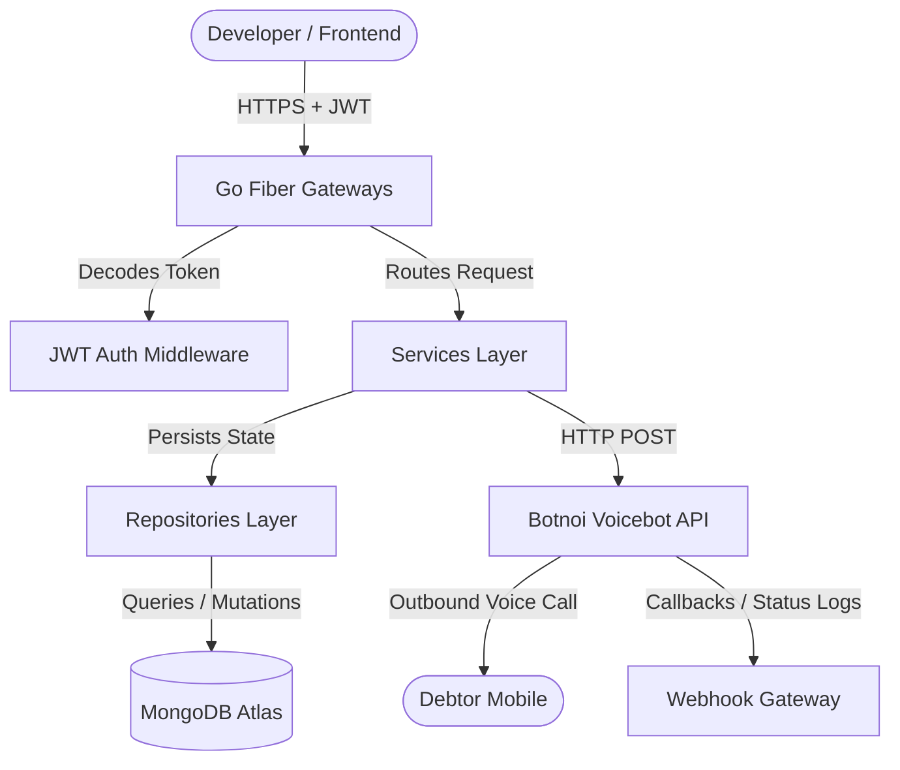
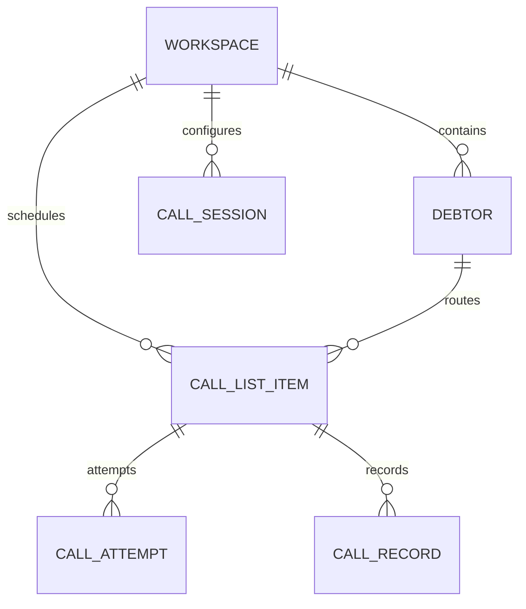

# Callecto Technical Architecture Reference Manual

This technical manual serves as the definitive architecture specification for the **Callecto Platform**. It details the architectural paradigms, implementation structures, database schemas, performance profiles, and security frameworks of the system.

---

## 🏛️ 1. Executive Summary

Callecto is a high-throughput, multi-tenant automated debt recovery platform that coordinates automated dialing campaigns utilizing AI-driven voicebots.

The backend is built as a single Go Fiber microservice integrated with MongoDB for datastore persistence. Originally developed as Deno Edge Functions, the system was refactored into a Go service to provide resilient session queue management, low latency webhook ingestion, and scalable execution limits.

---

## 🗺️ 2. System Architecture & Flow



### Key Lifecycle Sequence
1. **Workspace Provisioning**: Accounts are initialized in [workspaces.go](file:///home/cellul4r/Documents/botnoi/callecto-api/domain/entities/workspaces.go) to segregate debtors, templates, and call campaigns.
2. **Debtor Loading & Validation**: Debtors are enrolled with custom variables to power automated text-to-speech personalization.
3. **Queue Scheduling**: Tasks are scheduled inside the queue (`CallListItems`).
4. **Session Campaign Control**: Campaign dispatch starts background dialing routines.
5. **Webhook Callback Processing**: Incoming callback telemetry validates picked-up calls and stores audio URLs and conversation logs.

---

## 🧠 3. Design Decisions (ADRs)

### ADR-001: Porting Deno Edge functions to a Unified Go Fiber Service
- **Context**: Campaign queue workers in edge runtimes were susceptible to strict cold starts, timeout boundaries, and database connection exhaustion.
- **Decision**: Port the edge logic (originally found in files like [index.ts](file:///home/cellul4r/Documents/botnoi/callecto-api/index.ts)) into a dedicated Go service in [main.go](file:///home/cellul4r/Documents/botnoi/callecto-api/main.go) using the Fiber web framework.
- **Consequences**: Enhanced concurrency control, lower idle server cost, and unified logging.

### ADR-002: Fire-and-Forget Background Routine for Campaign Run
- **Context**: Campaign actions (`start` and `continue`) iterate through large queues of debtors. Responding synchronously results in API gateways timing out client requests.
- **Decision**: Trigger asynchronous campaign processing using Go's lightweight runtime threads (`Goroutines`) in [process_call_session.go](file:///home/cellul4r/Documents/botnoi/callecto-api/src/gateways/process_call_session.go#L46-L48).
- **Consequences**: Instant `200 OK` client responses, with processing running concurrently in the background.

---

## 📦 4. Core Components

### HTTP Routing & Gateway Layer
Routes requests to the service layer. Defined in [route.go](file:///home/cellul4r/Documents/botnoi/callecto-api/src/gateways/route.go).
- **Workspaces Gateway**: Manages multi-tenant groups.
- **Debtors Gateway**: Oversees debtor data lookup.
- **Call List Items Gateway**: Scheduled queues.
- **Call Attempts Gateway**: Dial logs.
- **Call Sessions Gateway**: Campaign parameters.
- **Webhook Gateway**: Telemetry callbacks.

### Database Persistence & Repository Layer
Implements domain interfaces to translate entity structs to Mongo queries.
- Defined in [repositories/](file:///home/cellul4r/Documents/botnoi/callecto-api/domain/repositories/).
- Uses UUIDv4 for ID allocation and enforces MongoDB atomic indexing.

---

## 🗄️ 5. Data Models



### Primary Database Schemas
- **DebtorModel**: Captures name, status, pickup statistics (success/rejection counts), and variables mapping. See details in [debtors.go](file:///home/cellul4r/Documents/botnoi/callecto-api/domain/entities/debtors.go#L7-L36).
- **CallSessionDataModel**: Campaign settings mapping concurrent call limits, retries, and business hours. See [call_sessions.go](file:///home/cellul4r/Documents/botnoi/callecto-api/domain/entities/call_sessions.go#L24-L40).
- **CallRecordDataModel**: General record matching provider IDs (`botnoi_call_id`). See [call_records.go](file:///home/cellul4r/Documents/botnoi/callecto-api/domain/entities/call_records.go#L29-L45).

---

## 🔌 6. Integration Points

### 1. Botnoi Voicebot Webhook Callback
Incoming webhook callbacks parse telemetry parameters:
- **Duration/Call Duration**: Converted dynamically (strings/numbers).
- **AMD Status**: Evaluates `last_amd_status` (HUMAN vs MACHINE).
- **Conversation Logs**: Written back to attempts for sentiment parsing.
- Implementation details can be found in [webhook.go](file:///home/cellul4r/Documents/botnoi/callecto-api/src/gateways/webhook.go).

---

## 🐳 7. Deployment Architecture

### Containerization
The service is packed as a minimal Alpine Go container defined in [Dockerfile](file:///home/cellul4r/Documents/botnoi/callecto-api/Dockerfile).

### Environment Configuration
Sensitive credentials are injected via environment parameters. Config variables include:
- `PORT`: Bind port (defaults to `8080`).
- `MONGODB_URI`: Connect string to Atlas.
- `JWK_SET_URL`: Well-known JSON Web Key URL for Supabase verification.
- `OUTBOUND_URL`: Botnoi dialer trigger service.
- `OUTBOUND_ACCESS_TOKEN`: API key authentication token.

---

## ⚡ 8. Performance Characteristics

### Async Campaign Processing
Campaign loops are initiated in non-blocking goroutines:
```go
go func() {
    _ = h.CallProcessService.ProcessSession(body.SessionID)
}()
```
The dispatcher logic checks limits:
- **Max Concurrency**: Constrains concurrent dials to stay under provider thresholds.
- **Timezone validation**: Prevents dialing debtors during invalid hours.

---

## 🔒 9. Security Model

### 1. JWT Signature Verification
Middleware verifies tokens against the keys retrieved from the remote JWK endpoint (`JWK_SET_URL`), verifying signature validity before decoding parameters.

### 2. Tenancy Isolation
All query operations explicitly enforce workspace verification:
```go
// Ensures users can only access entities within workspaces they own
data, err := h.DebtorService.GetDebtorsByWorkspaceByUser(tokenData.UserID, workspaceID)
```
Tenant variables are completely isolated within workspace boundary filters.
