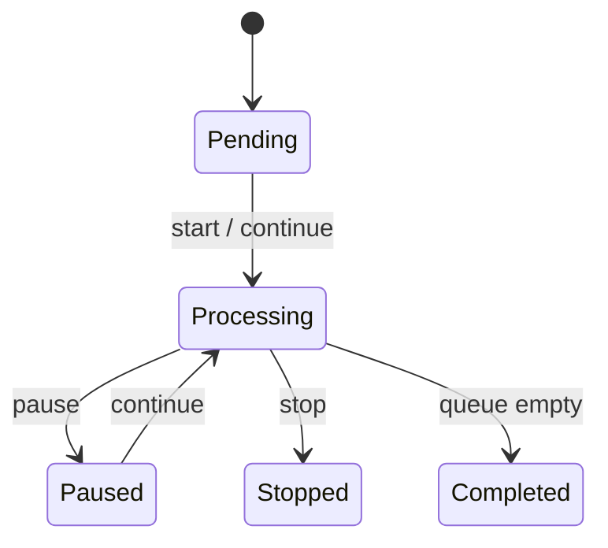

# Callecto Developer Onboarding & Integration Guide

Welcome to the **Callecto Developer Guide**. This document outlines the setup, architecture, security model, and code integration patterns for interacting with the Callecto API.

---

## 🚀 1. Quick Start

Callecto is a campaign dialer system mapping **Debtors** to scheduled call queues (**Call List Items**), which are processed as campaign runs (**Call Sessions**). All actions are performed in tenant-separated **Workspaces**.

### Prerequisites
- Go 1.21+ (for backend development)
- Node.js 18+ or Deno (for edge functions)
- A running MongoDB instance

### Local Development Setup
1. Clone the repository and navigate to the project directory:
   ```bash
   git clone https://github.com/natchanonsarasang/callecto-api.git
   cd callecto-api
   ```
2. Copy the `.env` template file:
   ```bash
   cp .env.example .env
   ```
3. Run the Go application:
   ```bash
   go run main.go
   ```

---

## 🔒 2. Authentication

All routes except for the public callback `/api/v1/webhooks/botnoi` require authorization through JSON Web Tokens (JWT).

Include the JWT in the header of each request:
```http
Authorization: Bearer <YOUR_JWT_TOKEN>
```

---

## 🛠️ 3. Integration Patterns & Code Examples

Here is how you can perform standard operations programmatically in different environments.

### Example A: Enqueuing a Debt Recovery Call (`POST /api/v1/call-list-items`)

#### cURL
```bash
curl -X POST http://localhost:8080/api/v1/call-list-items \
  -H "Authorization: Bearer YOUR_TOKEN" \
  -H "Content-Type: application/json" \
  -d '{
    "debtor_id": "deb_772819",
    "workspace_id": "wsp_92831",
    "template_id": "tpl_44928",
    "scheduled_at": "2026-06-25T14:30:00Z"
  }'
```

#### Node.js (Fetch)
```javascript
const enqueueCall = async (token, debtorId, workspaceId, templateId) => {
  const response = await fetch('http://localhost:8080/api/v1/call-list-items', {
    method: 'POST',
    headers: {
      'Authorization': `Bearer ${token}`,
      'Content-Type': 'application/json'
    },
    body: JSON.stringify({
      debtor_id: debtorId,
      workspace_id: workspaceId,
      template_id: templateId,
      scheduled_at: new Date(Date.now() + 86400000).toISOString() // 24 hours from now
    })
  });
  
  if (!response.ok) {
    const err = await response.json();
    throw new Error(err.message || 'Failed to enqueue call');
  }
  return await response.json();
};
```

#### Python
```python
import requests
from datetime import datetime, timedelta

def enqueue_debtor_call(token, debtor_id, workspace_id, template_id):
    url = "http://localhost:8080/api/v1/call-list-items"
    headers = {
        "Authorization": f"Bearer {token}",
        "Content-Type": "application/json"
    }
    payload = {
        "debtor_id": debtor_id,
        "workspace_id": workspace_id,
        "template_id": template_id,
        "scheduled_at": (datetime.utcnow() + timedelta(days=1)).isoformat() + "Z"
    }
    
    response = requests.post(url, headers=headers, json=payload)
    response.raise_for_status()
    return response.json()
```

---

## ⚡ 4. State Management (Campaign State Machine)

To start, pause, or stop outbound dials, interact with `/api/v1/call-process`.



### Control Request Structure:
- **`POST /api/v1/call-process`**:
  ```json
  {
    "session_id": "8fa19e34-bb3e-4361-bd80-d0f171050fb3",
    "action": "start"
  }
  ```

---

## ❌ 5. Error Handling Reference

All error payloads follow the standard response message format:
```json
{
  "message": "error description text"
}
```

| HTTP Status | Triggering Scenario | Remediation |
|-------------|---------------------|-------------|
| `400 Bad Request` | Missing required parameters like `workspace_id`. | Ensure query params and payloads match schema limits. |
| `401 Unauthorized` | Invalid, expired, or missing JWT Bearer token. | Refresh token or check token format details. |
| `403 Forbidden` | Accessing a workspace/debtor owned by another tenant. | Verify credentials/workspace permissions. |
| `404 Not Found` | The requested workspace ID, session ID, or record ID does not exist. | Double check UUID value. |
| `422 Unprocessable Entity` | Malformed JSON layout payload. | Match field naming formats. |
| `500 Server Error` | Provider API failure or Mongo write issues. | Retry operation or check logs. |
